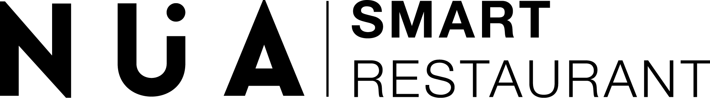

# NÜA Smart Reputation

[](https://opensource.org/licenses/MIT)

<div align="center">
  
  <h3>Inteligencia Artificial para la gestión de la reputación de restaurantes</h3>
</div>

## 🌟 Acerca de

NÜA Smart Reputation es una aplicación diseñada para ayudar a los restaurantes a gestionar y analizar su reputación online. Utilizando algoritmos de inteligencia artificial, la plataforma analiza reseñas de clientes, identifica tendencias y proporciona información valiosa para mejorar la calidad del servicio.

## ✨ Características

- **Dashboard Completo**: Visión general de todos los KPIs de reputación.
- **Análisis de Sentimiento**: Categorización automática de reseñas en positivas, neutras o negativas.
- **Respuesta con IA**: Genera respuestas profesionales a las reseñas de los clientes.
- **Seguimiento de Progreso**: Monitoriza la evolución de la reputación a lo largo del tiempo.
- **Análisis Detallado**: Profundiza en los comentarios para identificar áreas de mejora.
- **Gestión de Objetivos**: Establece y hace seguimiento de metas de reputación.

## 🚀 Tecnologías

- **Frontend**: React, TypeScript, Vite
- **UI/UX**: Tailwind CSS, shadcn-ui
- **Datos**: Tanstack React Query
- **Visualización**: Recharts
- **Routing**: React Router

## 🔧 Instalación

```bash
# Clona el repositorio
git clone https://github.com/nua-restaurants/smart-reputation.git

# Navega al directorio
cd smart-reputation

# Instala dependencias
npm install

# Inicia el servidor de desarrollo
npm run dev
```

## 📱 Capturas de Pantalla

<div align="center">
  <p><strong>Dashboard Principal</strong></p>
  <p>Visualización del panel principal con KPIs, análisis de sentimiento y tendencias de reseñas.</p>
</div>

<div align="center">
  <p><strong>Gestión de Reseñas</strong></p>
  <p>Interfaz para responder a las reseñas de clientes con asistencia de IA.</p>
</div>

## 📝 Uso

1. **Dashboard**: Visualiza KPIs y tendencias de reputación.
2. **Reseñas**: Gestiona y responde a reseñas de clientes.
3. **Análisis**: Explora datos detallados sobre los comentarios de los clientes.
4. **Objetivos**: Establece metas para mejorar la reputación.
5. **Configuración**: Integra con plataformas externas y personaliza la aplicación.

## 🤝 Contribución

Las contribuciones son bienvenidas. Por favor, lee las [pautas de contribución](CONTRIBUTING.md) antes de enviar un pull request.

## 📄 Licencia

Este proyecto está licenciado bajo la [Licencia MIT](LICENSE).

## 📞 Contacto

Para más información, contacta con [info@nua-restaurants.com](mailto:info@nua-restaurants.com).

---

<p align="center">Desarrollado con ❤️ por NÜA Restaurants</p>

